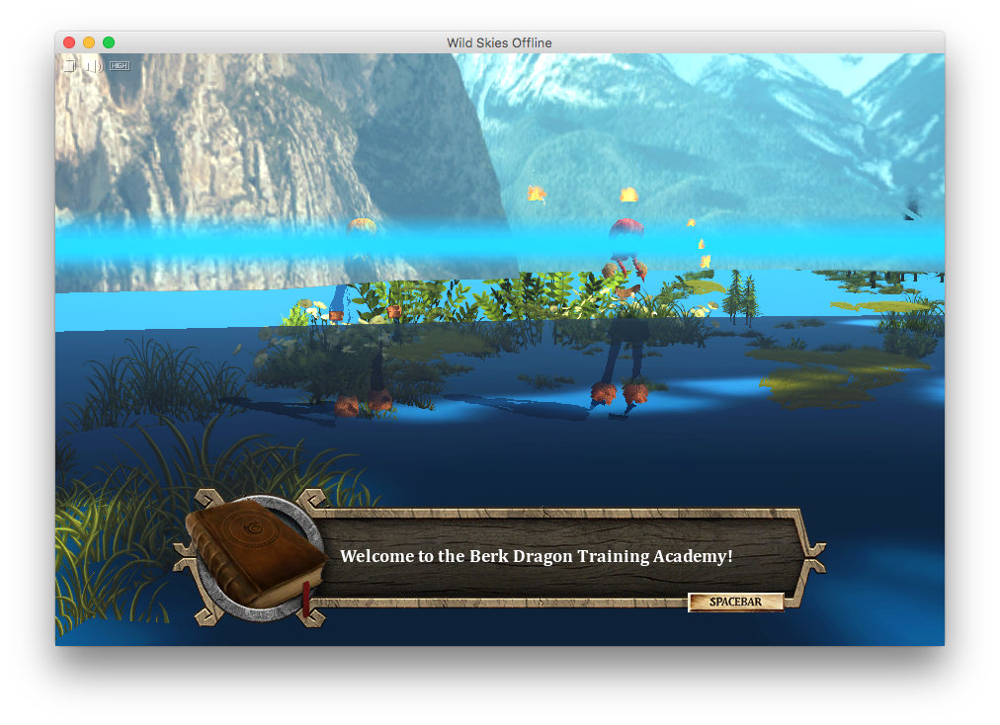

# macOS Bug

On macOS 10.12 or higher, this doesn't work. Instead of seeing the beautiful game graphics, you see this:

  

Why is this? No clue. I'm not a game developer. I don't know Unity. I _suspect_ it's something to do with macOS and 32 bit apps, however I thought Apple started removing 32 bit support in 10.13, not 10.12. Odd.

Is this fixable? Maybe. But probably not by me. If you know Unity game dev, and have any thoughts, please get in touch (either by [this reddit thread](https://reddit.com/r/httyd/comments/je9vgu/) or a GitHub issue). 
