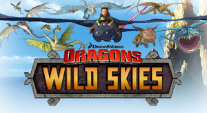

# WildSkies
An offline version for _DreamWorks Dragons: Wild Skies_

  

## Getting Started
First note that while this works well on Windows, it **does not work on macOS 10.12 and above!**. You can learn more on this see [this bug page](MAC.md).

Download the zip for either [Windows]() or [Mac](). On Windows, extract it somewhere, and run `WildSkies.exe`. On Mac, extract it and then run `WildSkies.app`.

You might be asked to allow a program past your firewall - this is to support saving and loading. You can actually deny this and it'll work just as well.

And that's it - you should see a window open and the game will load. Game progress is automatically saved as you progress, so you can just quit it, and then open the app again to resume. 

## A little history

_Wild Skies_ was a game made by Aquiris Game Studio for Cartoon Network to go along with their _Riders/Defenders of Berk_ TV show. Released in 2012, it followed the show and added new dragons and challenges to the game as they were discovered in the show.

However at some point DreamWorks' contract with Cartoon Network expired (the new show was due to air on Netflix instead), and they stopped supporting the game. First to break was the ability to save and load games (this was due to the server giving the wrong response when a game was saved), then browsers dropped support for the Unity Web Player browser plugin that the game relied upon. Cartoon Network removed the game from their main site, however there were still other sites running it, however all of these relied on Cartoon Network's CDN to serve the game assets, which quietly stopped resolving at some point in 2019/20.

But here it is, back again! I've made an offline wrapper for it which means you can keep on enjoying the game as if it was 2012 all over again! ([Unless you're running macOS 10.12 or higher.](MAC.md) Sorry about that.)

## How does it work?

It's a [Node Webkit](https://nwjs.io/) app, meaning it's essentially just Chrome with some extras built in. And then it runs a little server and patches into the game to support saving and loading of games locally. On Windows there's some interesting stuff going on to make Unity Web Player work, but nothing too complicated.